# 1. About  
Priority-enhanced INDI (PINDI) is an INDI-based control scheme for over-actuated systems, in which performance enhancement is achieved through prioritized control allocation (PCA).

Our open-source flight control project, the [DFUAV project](https://github.com/mengchaoheng/DuctedFanUAV-Autopilot), is forked from [PX4-Autopilot](https://github.com/PX4/PX4-Autopilot). Its main contributions include maintaining and extending multiple DFUAV-specific development branches (e.g., df-1.1x.x) and implementing a variety of control algorithms to support high-performance flight of ducted fan UAV platforms.

This work is part of the DFUAV project and includes:
1. Source code of the PINDI controller designed for DFUAVs equipped with four control vanes, provided in the form of a [patch](source_code_patch/dfuav.patch) based on PX4 v1.12.3. More details of usage can be found in the [readme](source_code_patch/readme.md). The controller can be directly deployed on flight controller hardware (e.g., [Pixhawk](https://pixhawk.org/)) for real-world flight tests and also supports software-in-the-loop (SITL) simulation, enabling reproduction of the reported flight experiments.
1. [Experimental procedures](settings.md) for various flight tests conducted using PINDI.
2. MATLAB source code for analyzing flight log files `xx.ulog`, the corresponding flight logs of the paper can be downloaded by clicking [download](https://drive.google.com/drive/folders/1Qt6lAV-oQqH-ZAz13f6aZQOPx-Y1A4mz?usp=sharing).


The full code of PINDI can also be found in the [DFUAV project](https://github.com/mengchaoheng/DuctedFanUAV-Autopilot). The PCA algorithm depends on [control_allocation](https://github.com/mengchaoheng/control_allocation), which is used to draw attainable sets and test control allocation algorithms. The MATLAB source code for analyzing flight log files depends on [ulog_matlab_plot](https://github.com/mengchaoheng/ulog_matlab_plot), which is used to parse PX4 log files and generate plots in MATLAB.  

<p align="center">
  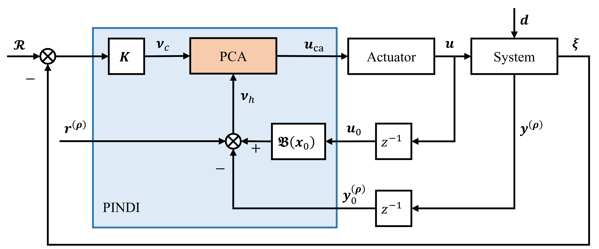
</p>
<p align="center">
  <em>Block diagram of the closed-loop system under the PINDI controller.</em>
</p>


# 2. Usage


## 2.1. Flight-controller source code
More details can be found in `/source_code_patch/readme.md` or in the `df-1.12.3` branch of the [DFUAV project](https://github.com/mengchaoheng/DuctedFanUAV-Autopilot). This paper conducted multiple experiments, with each experiment's ulg file recording detailed contents, including code version, parameter changes, and system response. Open-source tools [flight_review](https://github.com/PX4/flight_review) can also be applied to analyze the flight logs. The detailed implementation process and parameter settings of all experiments are provided in [setting file](settings.md).

Compiling the code and running the software-in-the-loop simulation is straightforward:

1. Clone the [DFUAV project](https://github.com/mengchaoheng/DuctedFanUAV-Autopilot).
```bash
git clone https://github.com/mengchaoheng/DuctedFanUAV-Autopilot.git
cd to DuctedFanUAV-Autopilot
```

2. Make sure you're on the `df-1.12.3` branch. You can use `git status` to check it.
```
git checkout df-1.12.3
```

3. Ensure that the required submodules for loading the df-1.12.3 branch are loaded.
```bash
git submodule update --init --recursive
```

When switching branches or wishing to recompile, you can use
```
make distclean
```

To keep a clean compilation, and then run
```
git submodule update --init --recursive

```
again to rebuild, The compilation command is as follows.

4. Building the code and start the simulation.
```bash
make px4_sitl gazebo_ductedfan4 # For start SITL simulation (gazebo-classic)
make px4_fmu-v5 upload # For the Pixhawk 4 controller
```

## 2.2. MATLAB plotting scripts

1. Download data from [data](https://drive.google.com/drive/folders/1Qt6lAV-oQqH-ZAz13f6aZQOPx-Y1A4mz?usp=sharing)

2. In `test_vview.m`, `df4_vview.m`, `compare_ca.m`, Change the dependency path to the path of your [control_allocation](https://github.com/mengchaoheng/control_allocation) library:

```m
addpath(genpath('~/Proj/control_allocation')); % Replace with your path 
```

If you need to analyze your log, change the path of `ulog2csv` (see [ulog_matlab_plot](https://github.com/mengchaoheng/ulog_matlab_plot)):

```m
ulog2csv_path = '~/Library/Python/3.9/bin/ulog2csv';
```


3. Plot file and its corresponding generated images
* compare_ca.m -> Figure_2
* df4_vview.m -> Figure_6
* test5_2_1_1.m -> Figure_9-Figure_11
* test5_2_2.m -> Figure_14-Figure_16
* test5_2_2RMS.m -> Figure_17
* test5_2_1_2.m -> Figure_12
* test5_2_1_3.m -> Figure_13
* realflight5_3.m -> Figure_20-Figure_22
* (**Additional**) test5_2_2_for_rate_loop_alone.m: Flight test with **only angular velocity loop**, corresponding to 5.2.2. The reference signal is changed to the heading angular velocity square wave signal, $\omega^{B}_{sp}=[0,0,\frac{\pi}{2}square(0.5\pi t)]^T$. The test process is the same as 5.2.2, and the results are similar to Figure_14-Figure_16

# 3. Results

## 3.1 Flight test using a complete control loop

<p align="center">
  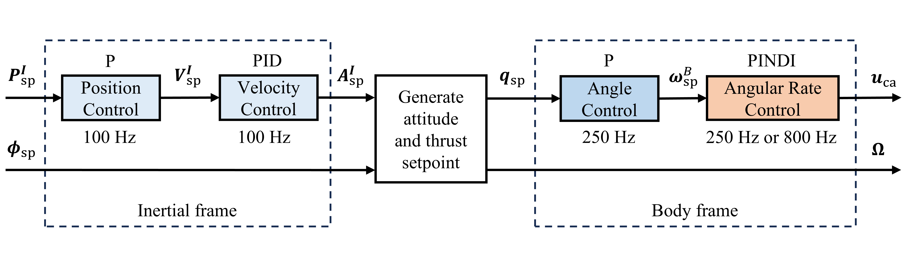
</p>
<p align="center">
  <em>Flight control architecture.</em>
</p>

<p align="center">
  
  
  
  
</p>
<p align="center">
  <em>Tracking performance under the PINDI controller in simulation.</em>
</p>

<p align="center"> 
  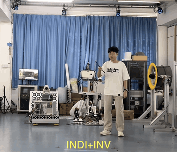
  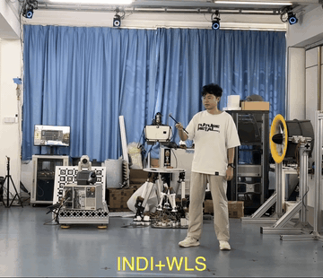
  
  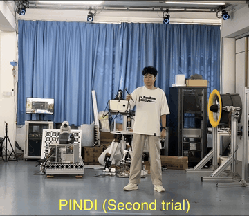
</p>
<p align="center">
  <em>Real-world flight tests.</em>
</p>

For more details, [simulation](https://www.youtube.com/watch?v=I5hA-lxqYqc) and [real-world flight test videos](https://www.youtube.com/watch?v=hm1Drz4iPa8) can be viewed on YouTube, or accessed by clicking the images below:

<div align="center">
  <a href="https://www.youtube.com/watch?v=I5hA-lxqYqc" target="_blank">
    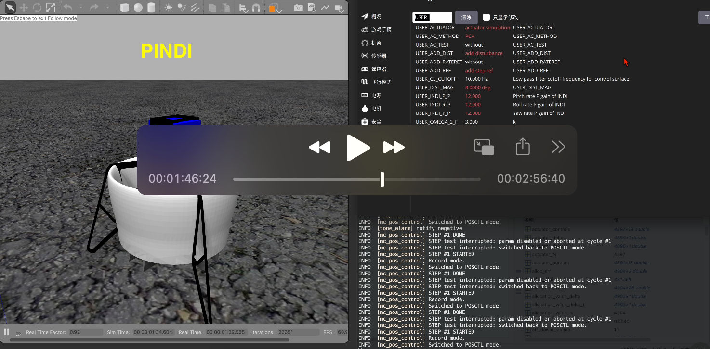
  </a>
  <br>
  <em>Simulation Video.</em>
</div>

<br>

<div align="center">
  <a href="https://www.youtube.com/watch?v=hm1Drz4iPa8" target="_blank">
    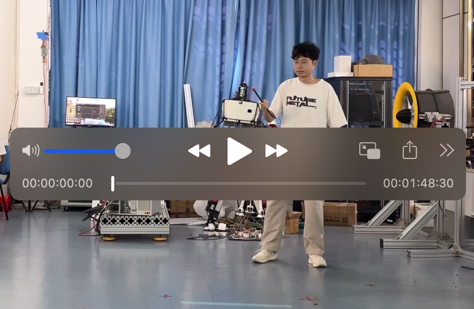
  </a>
  <br>
  <em>Real-World Flight Video.</em>
</div>


The UAV is hovered at a fixed point at a certain height, and after adding constant disturbance, the UAV tracks the heading reference square wave signal. The simulation and real-world flight test results are as above.

The running time of each part of the control strategy used for comparison on the pixhawk 4 mini controller (using STM32F765) is divided into the following three parts:

1. Allocator running time (µs).

Based on the test data in above, the average running time is calculated, where the INV allocation method pre-calculates the pseudo-inverse of the control effect matrix (average running time of 8.8712 µs). If the pseudo-inverse is calculated online, the average running time is 31 µs.


| Allocation method | Avg. Time (µs) | Allocation method | Avg. Time (µs) |
|-------------------|---------------:|-------------------|---------------:|
| INV               | 31             | WLS               | 105.4750       |
| DIR               | 207.6368       | PCA               | 171.4553       |


> **Note:** Please note that the runtime of the allocation algorithms depends on the problem dimension, test signals, and specific implementation details, but the overall order of magnitude remains stable. We can collect data during normal flight operations and compute the average runtime. Results from real flight experiments show that the variation in execution time does not exceed the order of magnitude. That is, the pseudo-inverse method typically takes on the order of a few tens of microseconds, while optimization-based allocation methods take approximately 100–300 microseconds.


2. Rate controller running time (us).

The INDI runtime is evaluated using `plot_setpoint_response.m` with the log file `log_43_2025-8-6-17-51-54.ulg`.

| Control method | Avg. Time (µs) | 
|----------------|---------------:|
| PID            | 2.3653         | 
| INDI           | 2.9966         |

3. Controller+Allocator running time.

Based on the experimental data in section 5.3, we have:

| Control scheme | Avg. Time (µs) | Control scheme | Avg. Time (µs) |
|----------------|---------------:|----------------|---------------:|
| INDI+INV       | 31+2.9966=34             | INDI+WLS       | 2.9966+105.4750=108       |
| INDI+DIR       | 2.9966+207.6368=211      | PINDI          | 2.9966+171.4553=174       |

## 3.2 Flight test using only angular velocity control

To address the reviewer's concerns, we add this section to show flight tests of only the angular velocity loop. In order to make the experiment repeatable, we use simulation as an example to demonstrate. For more information on this aspect, please refer to our other article titled "Attitude Control of Ducted Fan UAV Based on INDI and Priority Control Allocation".

In the simulation, we adopt similar operational steps as in the previous section, first adding external disturbances after the aircraft hovers and then observing the angular velocity tracking response. 

<p align="center">
  
</p>
<p align="center">
  <em>Flight control architecture.</em>
</p>

<p align="center">
  
  
  
  
</p>
<p align="center">
  <em>Angular rate tracking performance under the PINDI controller in simulation.</em>
</p>

Similarly, the [simulation](https://www.youtube.com/watch?v=dy4ZfORP_HU) using only the angular velocity loop can be viewed on YouTube or accessed by clicking the images below:
<div align="center">
  <a href="https://www.youtube.com/watch?v=dy4ZfORP_HU" target="_blank">
    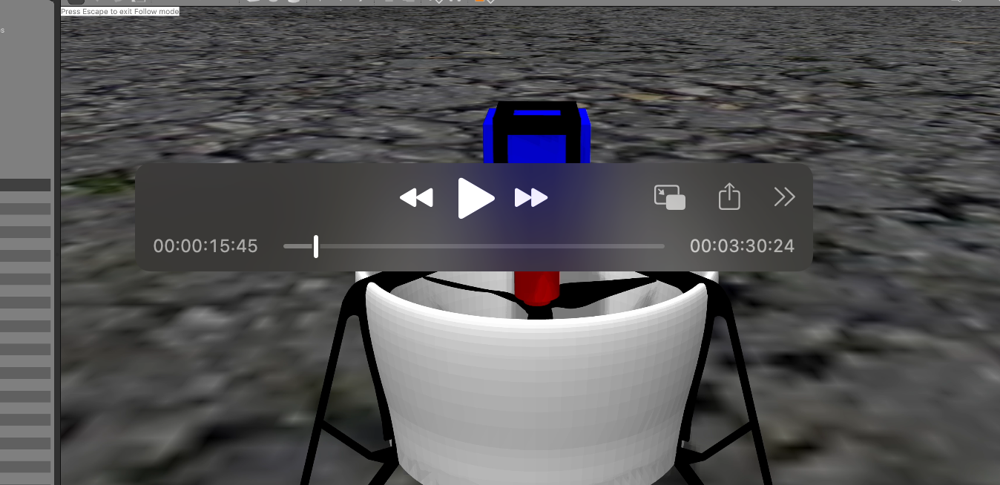
  </a>
  <br>
  <em>Simulation Video.</em>
</div>


Similar to the analysis in sections 5.2.2 and 5.3 of the paper, we present the flight test results with only angular velocity loop control in the simulation as follows. Figures 14*-Figure 16* correspond to Figures 14-Figure 16 in the paper.

<p align="center">
  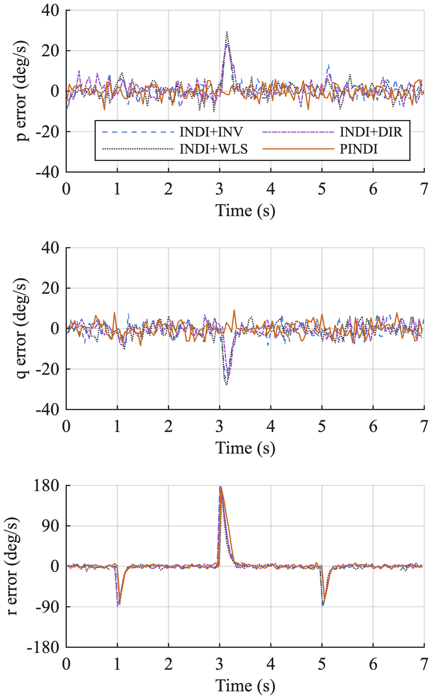
  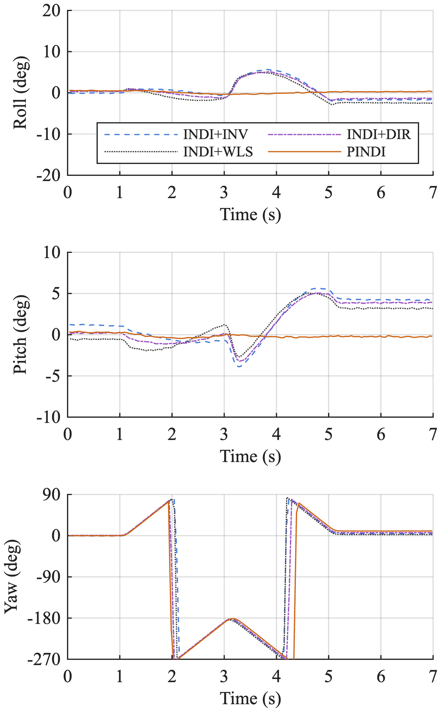
</p>

<p align="center">
  <em>
  Figure 14*. Attitude response and angular velocity tracking error under different control schemes (rate loop alone).
  </em>
</p>

<p align="center">
  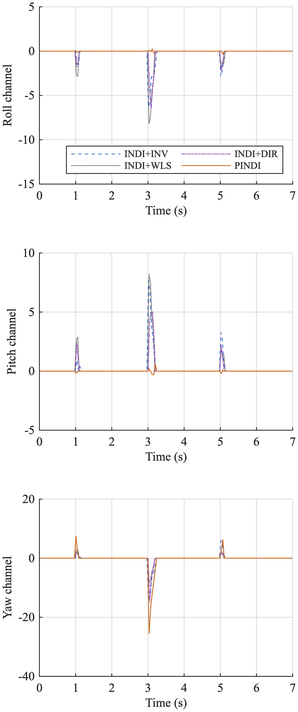
  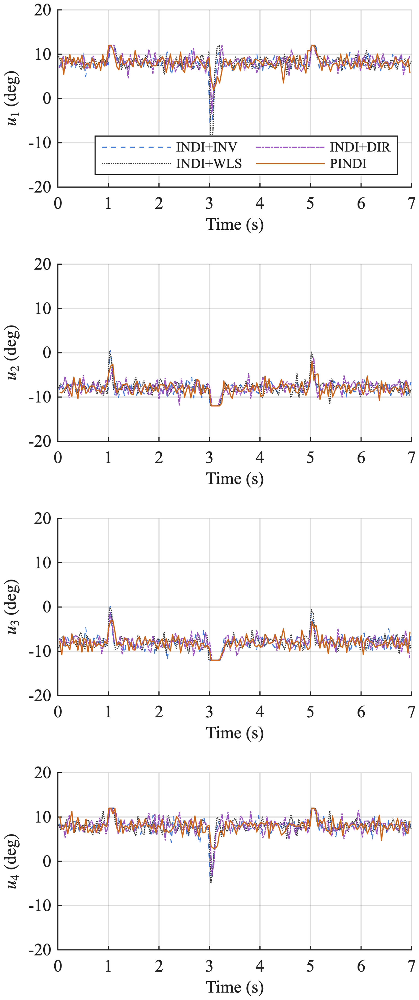
</p>

<p align="center">
  <em>
  Figure 15*. Allocation error and allocation result under different control schemes (rate loop alone).
  </em>
</p>

<p align="center">
  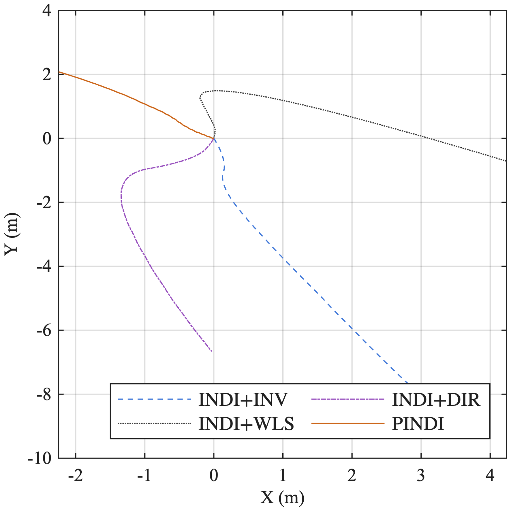 
</p>

<p align="center">
  <em>
  Figure 16*.  Position response under different control schemes (rate loop alone).
  </em>
</p>